# Final Project: Hotel Cancellation Forecast 

### Current Status of Project: Segment 2 finished

**Segment 2:**
- Create a detailed Readme report on current status of project, links to data, slide deck, other important references
- Machine learning model with confusion matrix and accuracy score
- Updated database 
- Description of the data, questions the team originally planned to answer, EDA, analysis phase and technologies
- Draft Google Slides presentation

**Challenges:**
- We are continuing to try to optimize our model for a better accuracy score. Right now we have an 88% accuracy score for a Random Forrest Model

**Plans for future work:**
- Individually, continue to try and optimize our model for higher accuracy scores 
- Work on the Google Slides Presentation
- Work on finalizing our Tableau


## Background and Purpose 
**Topic:** Can you predict if a customer is going to cancel their reservation based on their hotel booking?

**Reasoning:** The hotel industry can lose a significant amount of money from canceled reservations. If they were able to predict hotel cancellations, they would be able to plan accordingly to save further financial loss. The **purpose** of this project is to find out how can we best predict hotel booking cancellations. 

**Description of the Data:** Initially the data came from two datasets for two types of hotels: Resort and City hotels in Portugal from July 1, 2015 to August 31, 2017 ([Hotel Booking Demand Datasets](https://www.sciencedirect.com/science/article/pii/S2352340918315191)).

***Variable Descriptions:*** 
- Hotel (Categorical): Type of hotel (Resort Hotel or City Hotel)
- IsCanceled (Categorical): Value indicating if the booking was canceled (1) or not (0)
- LeadTime (Integer): Number of days that elapsed between the entering date of the booking into the PMS and the arrival date
- ArrivalDateYear (Integer): Year of arrival date
- ArrivalDateMonth (Categorical): Month of arrival date within 12 categories (January to December)
- StaysInWeekendNights (Integer): Number of weekend nights (Saturday or Sunday) the guest stayed or booked to stay at the hotel
- StaysInWeekNights (Integer): Number of week nights (Monday to Friday) the guest stayed or booked to stay at the hotel
- Adults (Integer): Number of adults
- Children (Integer): Number of children
- Babies (Integer): Number of babies
- Meal (Categorical): Type of meal booked. Categories are presented in standard hospitality meal packages. Undefined/SC = no meal package, BB = Bed & Breakfast, HB = Half board (breakfast and one other meal-usually dinner), FB = Full board (breakfast, lunch and dinner)
- Country (Categorical): Country of origin. Categories are represented in ISO format.
- MarketSegment (Categorical): Market segment designation. TA = Travel Agents, TO = Tour Operators
- IsRepeatedGuest (Categorical): Value indicating if the booking name was from a repeated guest (1) or not (0)
- PreviousCancellations (Integer): Number of previous bookings that were canceled by the customer prior to the current booking
- PreviousBookingsNotCanceled (Integer): Number of previous bookings not canceled by the customer prior to the current booking
- BookingChanges (Integer): Number of changes/amendments made to the booking from the moment the booking was entered on the PMS until the moment of check-in or cancellation
- DepositType (Categorical): Indication on if the customer made a deposit to guarantee the booking. Three categories: No Deposit = no deposit was made, Non - Refund = a deposit was made in the value of the total stay cost, Refundable = a deposit was made with a value under the total cost of stay
- DaysInWaitingList (Integer): Number of days the booking was in the waiting list before it was confirmed to the customer
- CustomerType (Categorical): Type of booking. Four categories: Contract = when the booking has an allotment or other type of contract associated to it, Group = when the booking is associated to a group, Transient = when the booking is not part of a group or contract, and is not associated to other transient booking, TransientParty = when the booking is transient, but is associated to at least other transient booking
- ADR (Numeric): Average Daily Rate
- RequiredCarParkingSpaces (Integer): Number of car parking spaces required by the customer
- TotalOfSpecialRequests (Integer): Number of special requests made by the customer (e.g. twin bed or high floor)
- ReservationStatus (Categorical): Reservation last status. Three categories: Canceled = booking was canceled by the customer, Check-Out = customer has checked in but already departed, No-Show = customer did not check-in and did not inform the hotel of the reason why


**Research Question(s):**
- Can you predict if a customer is going to cancel their reservation based on their hotel booking?
- Which factors/ features can predict customer cancellations?


## Resources
- Original Dataset: [Hotel Bookings Dataset](https://www.kaggle.com/datasets/jessemostipak/hotel-booking-demand) sourced from article [Hotel Booking Demand Datasets](https://www.sciencedirect.com/science/article/pii/S2352340918315191)
- Technologies: Google Colab, PgAdmin, Tableau
- Languages: Python, SQL
- Algorithms:
  - Machine Learning Model: Binary Logistic Regression Model
  - Libraries: 
    - Pandas
    - Scikit-learn
    - Seaborn
    - Tensorflow
    - Matplotlib
    - Numpy

## Results
- [Final Presentation](https://docs.google.com/presentation/d/1HDH8MzOXkqZIBVwwQJ9A0n3o-WJ2LfAWJDuUSSZJil4/edit?usp=share_link)
- [Exploratory Data Analysis Notebook](https://github.com/abrodyyy/Hotel_Repo/blob/main/Hotel_ExploratoryAnalysis.ipynb)
- [Preprocessing Data &  Machine Learning Model Notebook](https://github.com/abrodyyy/Hotel_Repo/blob/main/Hotels_Preprocessing_MLModel.ipynb)
- [Optimizing the ML Model](https://github.com/abrodyyy/Hotel_Repo/blob/main/Optimizing_ML_Model.ipynb)
- [Interactive Dashboard](https://public.tableau.com/app/profile/alexandra.brody/viz/Hotel_Bookings_EDA/HotelBookingsExploratoryDataAnalysis?publish=yes)

### Description of the EDA & Analysis phase 

**Exploratory Data Analysis**

After going through a couple of datasets, we finally found a dataset that contained almost 119,000 rows and 32 columns of data on Hotel Booking Demands. At the beginning of our Exploratory Data Analysis phase, we inspected the data and created a correlation matrix to see if there were any strong correlations with our target column “is_canceled.” We could not find any strong correlations with our columns and the target variable. Next, we used our cleaned dataset to further look into any trends our data might tell us. We first looked at how many cancellations there were per hotel type. 

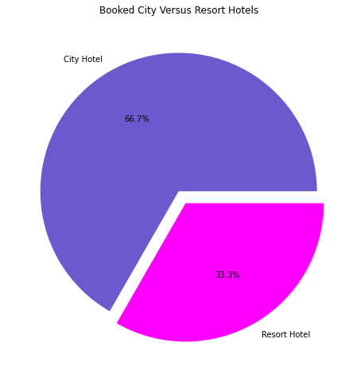
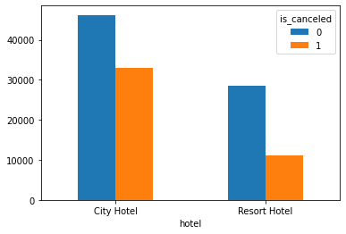

From the pie chart above, we saw that the majority of the bookings were for the City hotel (66.7%) vs. the Resort hotel (33.3%). We also noticed the general trend with the more bookings, there are more cancellations in both types of hotels. With a total of 118,898 Total Bookings, 44,153 were canceled. Of the total cancellations, there were: 
- Resort Hotel Bookings Canceled: 11,077 (25.09% of Total Cancellations)
- City Hotel Bookings Canceled: 33,076 (74.91% of Total Cancellations)

After looking at the number of bookings and cancellations per hotel type, we experimented with the different features affecting our target variable.
We also split the dataset by hotel type. After creating different initial visualizations to show the trends for different features, we gathered as a team to discuss and analyze what we thought was important to note about our data. 

**Analysis Phase**
- **Bookings & Cancellations Per Month** 

After grouping our data to analyze the trends we could observe per month, we found that overall  the months with the highest booking amount were the months of August, closely followed by July. Additionally, we found these months contained the highest amount of cancellations per month, followed closely by June and September.

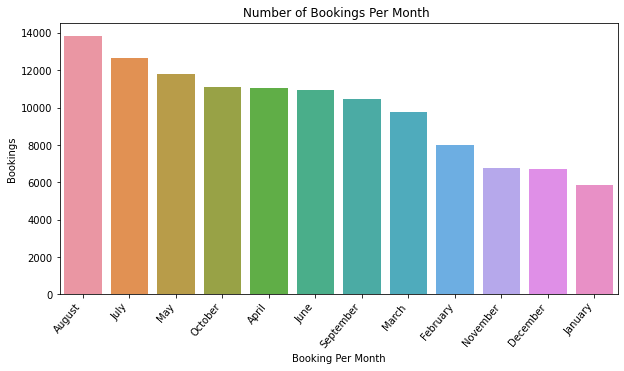
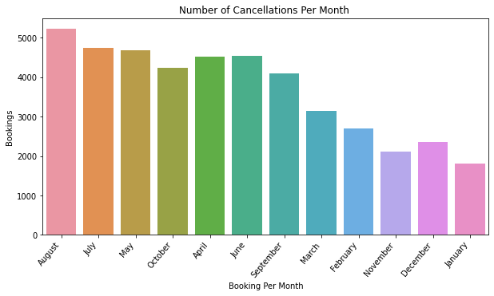

- **Average Daily Rate Per Month**

To support the trend shown above, we created more plots to observe how each month would perform but we shifted our focus to the column of average daily rate in which we color coordinated our months based on the seasons. As we anticipated,there was a higher average daily rate during the months that contained the highest amount of bookings and cancellation. The image shown below showcases the fact that there are a higher amount of bookings in the warmer seasons(represented by the color red) than the colder seasons(represented by the color blue).

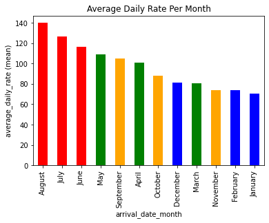

The observations shown above can also be supported by additional analysis' of the column average daily rate per month and type of hotels. The plots shown below show a continuous trend over the same months of June, July, and August. Over the three years we studied, these months continued to be the ones containing the highest average daily rate. Unsurprisingly, these months are also the months we observed before containing a higher amount of bookings and cancellations. We can also see the connection of this trend with the types of hotels. The type of hotel that contained the higher amount of bookings and cancellations also contained the higher amount of average daily rate.
 
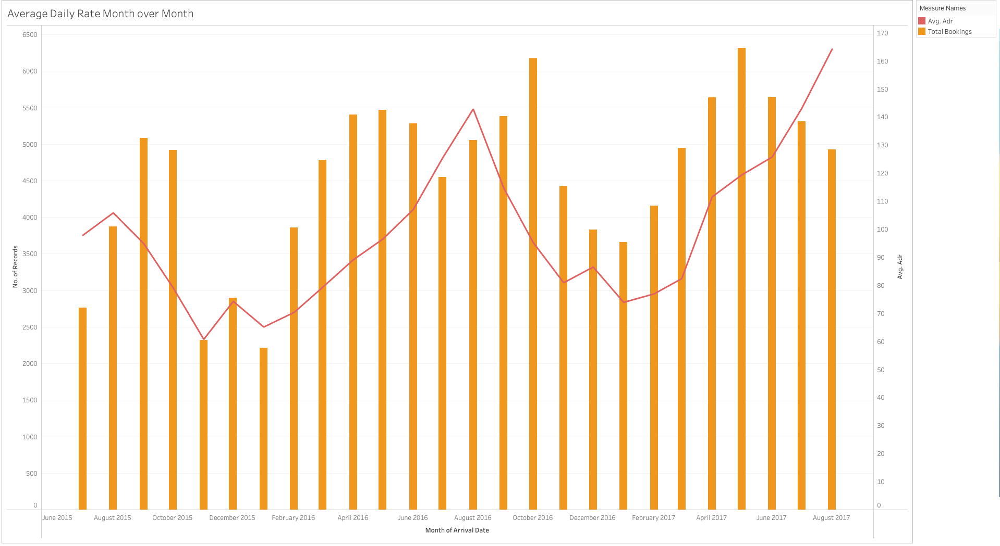
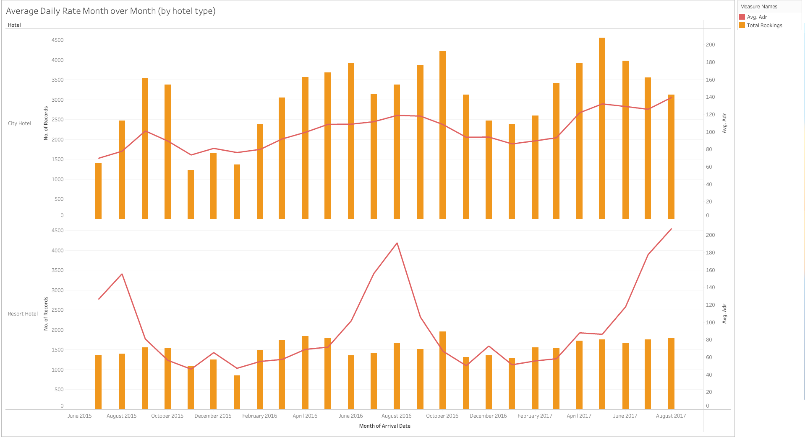

- **Lead Time vs Bookings**

Lastly, we analyze the column of lead time to investigate whether there was a trend in this column or not. To make our observations faster, we created a boxplot containing the boxplots of lead time versus the booking status of confirmed and cancelled. We noticed a higher mean of lead times in cancellations than confirmations, which leads us to believe that the longer a customer makes their reservation, the more likely they are to cancel their bookings. 

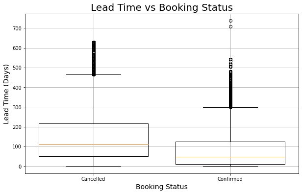

### Cleaning & Preprocessing Data for ML Model

- After using the Pandas library to import our data csv, we explored the columns and looked for columns with null values and duplicate values. We realized the duplicated values could just be from similar reservations so we left those values. For the columns with null values, initially we dropped (columns = “agent”, “company”) since they made the most null values and didn’t have much of a significant correlation to our target column. 
- After looking at our columns, we felt like we had too many features. We looked at what each column represented and decided to drop more columns that may not be necessary for our analysis. This left us with the final columns for preprocessing and machine learning: 'hotel', 'is_canceled', 'lead_time', 'arrival_date_month', 'stays_in_weekend_nights', 'stays_in_week_nights', 'adults', 'children', 'babies', 'meal', 'market_segment', 'is_repeated_guest', 'previous_cancellations', 'previous_bookings_not_canceled', 'deposit_type', 'days_in_waiting_list', 'customer_type', 'adr', 'required_car_parking_spaces', 'total_of_special_requests'
- Next, in the preprocessing step, we hard-coded the month columns with respective numbers. 
- Then we imported ```StandardScaler``` and ```OneHotEncoder``` libraries to encode the list of categorical variables, merged the one-hot encoded features and dropped the originals. Next we split the preprocessed data into features and target arrays, used ```test_train_split```, then scaled our final training and testing datasets. We were now ready to use our training and testing datasets for our Machine Learning Model(s).


### Machine Learning Model Results: 

#### Binary Logistic Regression Model

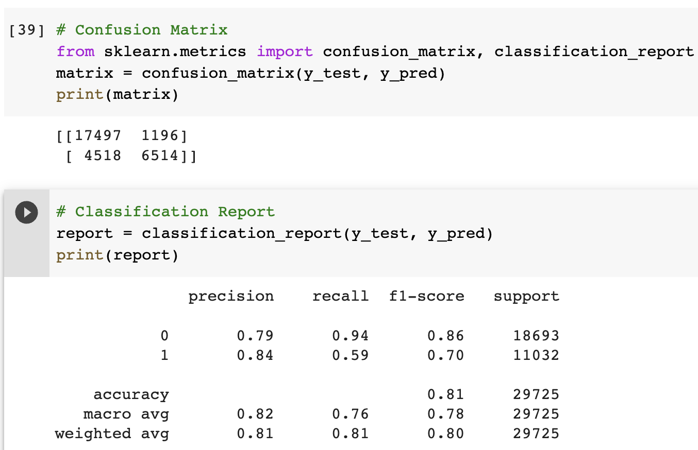

- Our targeted variable is binary, and a logistical model would be ideal for this case. In general, the logistical model is used to find what is the probability for an event to be categorized in one group or another.
- We trained this model using the ```train_test_split``` library from ```sklearn.model_selection```. It splits the data into 80% and 20% for training and testing datasets. After splitting the preprocessed data, we used the ```StandardScaler``` to scale the X_train and X_test datasets. 
- The Logistic Regression model predicts binary outcomes. It analyzes the data, and determines its probability of belonging to one of the classes.
- The analysis will include a description and interpretation of the values in the classification report and confusion matrix. The scores of interest in the classification report will be the accuracy, precision, recall, and F1 score for our model’s ability to predict if a booking will be canceled. The description of the confusion matrix is necessary because it provides the number of true positives, true negatives, false positives, and false negatives returned by the model which are used to generate the classification report. The accuracy score will measure the number of correct predictions made by the model in relation to the total number of predictions made. Precision will tell us the percentage of correct positive predictions relative to total positive predictions. Recall will tell us the percentage of correct positive predictions relative to the total actual positives. The F1 score will represent a weighted mean of precision and recall to give us a rounded assessment of model performance. 

Interpretation of our logistic regression scores:

- Accuracy (0.807771236333053): Our model correctly predicted whether a booking would be canceled 80.78% of the time. 
- Precision (0.84): Out of all the bookings the model predicted would be canceled, only 84% actually were.
- Recall (0.59): Out of all the bookings that were actually canceled, the model only predicted this outcome correctly for 59% of those bookings.
- F1 Score (0.70): The value is somewhat close to 1 which means that the model does an “ok” job at predicting cancellations. However, we would ideally want a higher score given that our model’s predictions would impact decisions on the hotel’s/hospitality industry’s side that could affect business.


#### Random Forrest Classifier Model

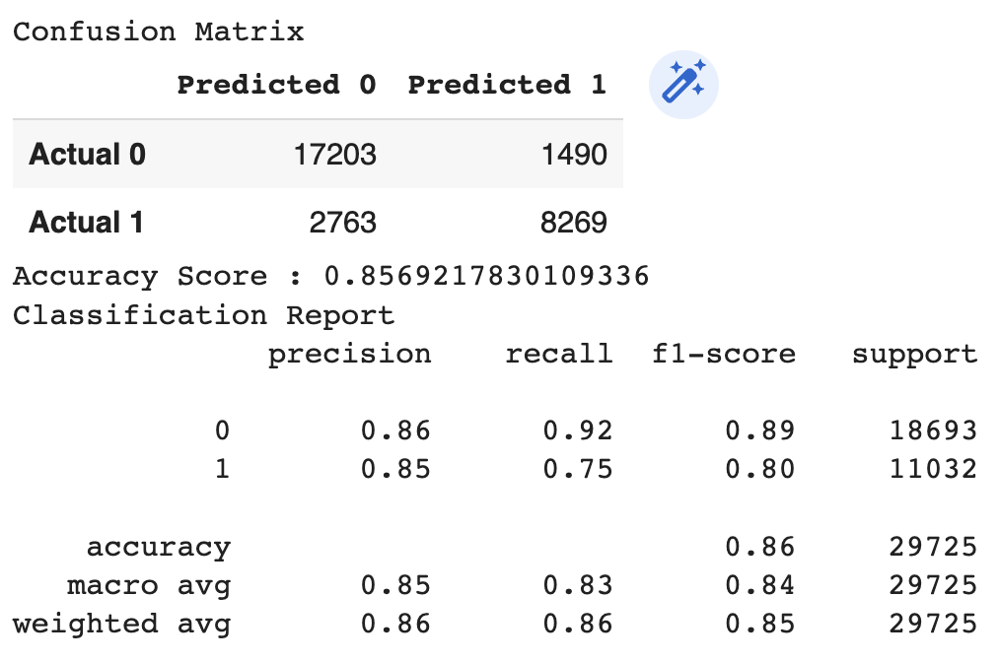

- Since we had only an 80.77% accuracy score for this model, we tried the Random Forrest Classifier model. 
- For this model, we were able to increase our accuracy score to 85.69%. 
- Our precision for non-cancellations increased to 86% and the recall for cancellations also increased to 75%. 
- Overall, the Random Forrest Classifier produced better results than the Binary Logistic Regression model. If we had more time, we would use the time to optimize our model by using a booster or changing the way we preprocessed our data. 


#### Optimizing the Model & Feature Importances
- For optimizing the model, the way the data was processed changed. 
- The countries were encoded and the “other” country category was included with a count of 18,102
- Our precision increased to 88% and the recall also increased to 79%.
- The changes in pre-processing the data allowed for greater precision in the accuracy testing. 

- Using ‘feature_importances_’ we were able to get an array of data that tells us how important a feature was to the model prediction. From there Numpy was used to sort the feature by importance and label which column it belonged to. We can see from the data that the ‘days_in_waiting_list’ column was most utilized at 12.32%, followed by 'deposit_type_no_deposit', 'market_segment_online_TA', 'lead_time' and 'country_Other'.


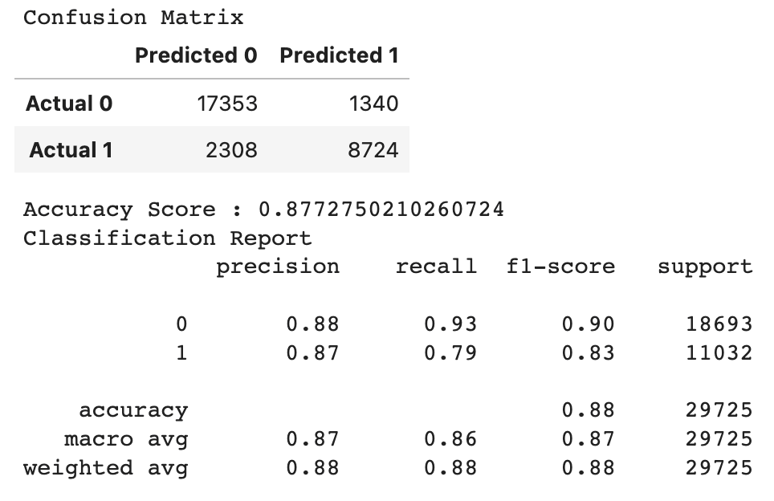

**Feature Importances (Top 10):**
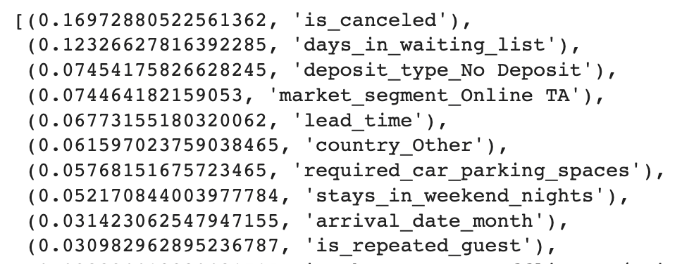


### Recommendations for Future Analysis

- In the current dataset, both hotels were located in Portugal. One recommendation is to collect data from hotels in other countries and regions to determine if  the location of the hotel significantly impacts any of the variables/features used in the current research. Doing a more in depth statistical analysis for each individual variable to determine the significance before dropping columns/ variables. 
- The team would have tested other machine learning classification algorithms, such as K-nearest neighbors and Naive Bayes classifier. Then compared their results to the accuracy, precision, and recall scores received from the random forest and logistic regression models to determine the best model for the dataset.
- We could have used boosters to also improve our accuracy scores for our models 
- The team may have divided the dataset between the two types of hotels (city vs. resort) and done an analysis on each type. This would have allowed the team to thoroughly investigate whether any of the variables/features have a higher level of significance with the type of hotel. 
- The team constructed a correlation table to investigate the strength of association between variables and the direction of their relationship. However, in addition the team would have conducted individual t-tests that display the pvalue for each variable. This would indicate the level of significance the variables have with hotel cancellations (IsCanceled variable). 
- Furthermore, we may have used other technologies to analyze the data and create data visualizations, such as incorporating R and one of its packages Shiny. The team would have used Shiny to construct an interactive web application that assists with looking at cancellation patterns with interactive visualizations. 
